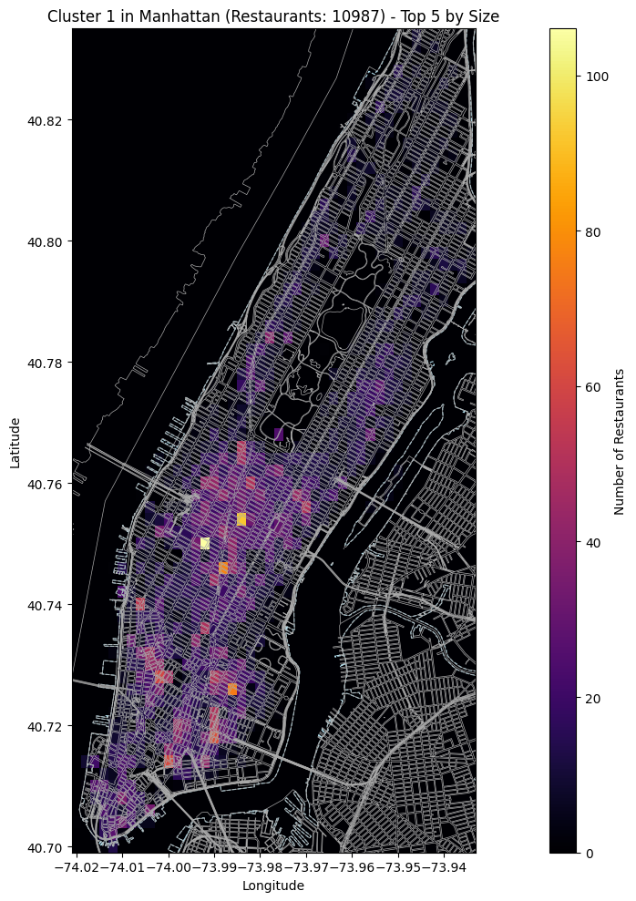

# NYC Restaurant Website Retrieval Project

## Overview
This project focuses on efficiently retrieving website information for all restaurants in New York City using the Google Places API. While NYC has a comprehensive database containing addresses and geographical coordinates for all its restaurants, it notably lacks website information. The goal is to collect website URIs for these known locations, which will later be scraped for menu data to populate a restaurant recommendation application.

[Project Notebook](project_notebook.ipynb)

## Challenge
To obtain each restaurant's website URI, individual API calls using the business's name and/or address are an option. However:
- **Cost per call**: $0.05.
- **Total restaurants**: ~30,000.
- **Total cost**: $1,500 for individual calls.

A more cost-effective approach is leveraging the Google Places Nearby Search API, which can return website URIs for up to 20 restaurants in a single call for the same $0.05. This approach can reduce the total cost by up to 20x in the best-case scenario.

## Methodology
The Google Places Nearby Search API provides results based on a given geographic coordinate and search radius, filtering results by place type (e.g., "restaurant"). To minimize costs, the task becomes optimizing the number and parameters of API calls while ensuring complete coverage of all restaurant locations.

### Optimization Goal
Each restaurant's geographic coordinate must be captured within the radius of a nearby search call. This is framed as a geometric set cover problem: how to cover all restaurant locations with the fewest API calls (circles).
- Each circle can contain up to 20 restaurants.
- The goal is to minimize the total number of circles.

## Workflow
The project is structured into the following steps:

### 1. Data Preparation
- **Input**: Raw NYC restaurant inspection database.
- **Processing**: Cleaning and standardizing geographic coordinates for all restaurant locations.

### 2. Geometric Coverage Optimization
- **Approach**: Solve the set cover problem using greedy and linear programming algorithms.
- **Output**: Generate circles (API call parameters) with variable radii and centers to:
  - Minimize the number of calls.
  - Ensure each circle contains no more than 20 restaurants (API constraint).

### 3. Output File Generation
- **Purpose**: Create a blueprint for API calls.
- **Contents**: A file listing parameters for each API call, including:
  - Latitude
  - Longitude
  - Radius
- This file ensures complete and efficient data retrieval for all restaurants in NYC.

## Visualization
Below is a heatmap of restaurant locations in Manhattan:



## Results
This optimized approach significantly reduces costs and provides a scalable method for retrieving website URIs, laying the groundwork for subsequent menu scraping and integration into the recommendation application.

---

## Instructions to Launch
To set up and launch the project, follow these steps:

### Option 1: Use Docker
1. Build the Docker image:
   ```bash
   docker build --progress=plain -t project_notebook .
   ```
2. Run the Docker container:
   ```bash
   docker run -it --rm -p 8888:8888 -v $(pwd):/app project_notebook
   ```
3. Open the link generated in the terminal to access the Jupyter Notebook.

### Option 2: Manual Setup
1. Ensure Python is installed on your system.
2. Install the required dependencies:
   ```bash
   pip install -r requirements.txt
   ```
   Alternatively, you can run the code in **Part 0** of the notebook to install the dependencies.
3. Launch the project notebook.

